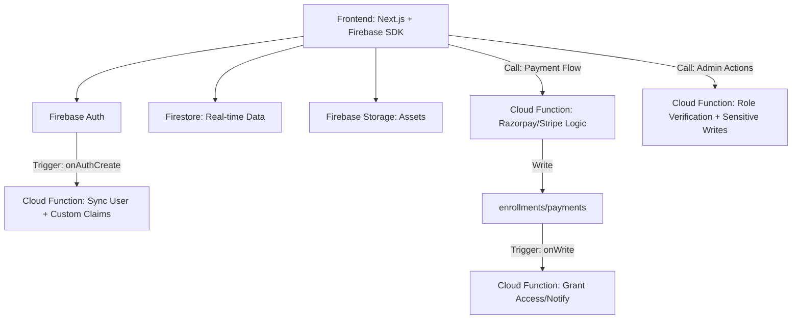

# 🚀 Academy Firebase Backend Architecture (2026 Production Standards)

## 1. 🏗️ High-Level System Design
The system transitions from a monolithic Express API to an Event-Driven, Serverless architecture.

---

## 2. 📊 Firestore Schema (Strict)

### `users/{uid}`
- `uid`: string (Primary Key)
- `fullName`: string
- `email`: string (Unique, lowercase)
- `role`: enum ('student', 'teacher', 'admin', 'super_admin')
- `status`: enum ('pending', 'approved', 'rejected')
- `bio`: string (for teachers)
- `avatar`: string (managed URL)
- `createdAt`: serverTimestamp
- `lastLogin`: timestamp

### `courses/{courseId}`
- `title`: string
- `slug`: string (indexed)
- `description`: string
- `category`: string
- `price`: number
- `instructorId`: reference(`/users/{uid}`)
- `thumbnail`: string
- `validity`: number (days)
- `isActive`: boolean
- `stats`: { enrolledCount: number, rating: number }

### `enrollments/{enrollmentId}`
- `userId`: reference(`/users/{uid}`)
- `courseId`: reference(`/courses/{courseId}`)
- `purchaseDate`: serverTimestamp
- `expiresAt`: timestamp
- `status`: enum ('active', 'expired', 'refunded')

### `audit_logs/{logId}`
- `timestamp`: serverTimestamp
- `actorId`: string (UID)
- `action`: string (e.g., 'ADMIN_ROLE_CHANGE')
- `targetId`: string
- `metadata`: object

---

## 3. 🛡️ Security Strategy

### Custom Claims Enforcements
- Admin: `{ admin: true }`
- Teacher: `{ teacher: true }`
- Access Control: Claims are verified in Firestore Rules and Function middleware.

### Firestore Security Rules Highlights
- **Deny by default**: `allow read, write: if false;`
- **Role-based writes**: Only `admin` can write to `courses/` or change `users.role`.
- **Ownership-based reads**: Students only see their own `enrollments/`.

---

## 4. 📉 Scaling & Cost Optimization Strategy (1K → 1M Users)

### Phase 1: 1K - 10K Users
- Standard Firestore usage.
- Simple Gen 2 functions.
- Cost: Nearly $0 (within Free Tier).

### Phase 2: 10K - 100K Users
- **Caching**: Implement Redis/Cloud CDN for public course catalogs if needed.
- **Aggregation**: Use Cloud Functions for counter increments (`enrolledCount`) to avoid write hotspots.
- **Bundle Downloads**: Gzip/Brotli assets in Storage.

### Phase 3: 1M+ Users
- **Sharding**: If `audit_logs` hit massive scale, use BigQuery for long-term storage via Cloud Function sink.
- **Filtering**: Use Firestore Bundles for faster cold-starts on the frontend.
- **Edge Functions**: Deploy specific logic to Firebase Data Connect or Edge locations.

---

## 5. 🛠️ Failure Scenarios & Recovery

| Scenario | Impact | Recovery Plan |
| :--- | :--- | :--- |
| **Payment Webhook Failed** | Enrollment not granted | Idempotent Functions retry logic (Firestore Transaction check). |
| **Auth Provider Outage** | Users cannot login | Multi-provider support (Google + Ph + Email). |
| **Firestore Query Hotspot** | Latency Spikes | Distributed counters & Read-replicas via Redis cache. |
| **Invalid Code Deployment** | System crash | Point-in-time recovery for Firestore & Cloud Functions rollback. |

---

## 6. 💰 Cost Optimization
- **Batching**: Never update Firestore fields one by one; use `update({ a:1, b:2 })`.
- **Selective Data**: Don't fetch full `course` objects for search cards; fetch only needed fields.
- **TTL**: Auto-delete expired sessions or notifications using `ttl` field in Firestore.
